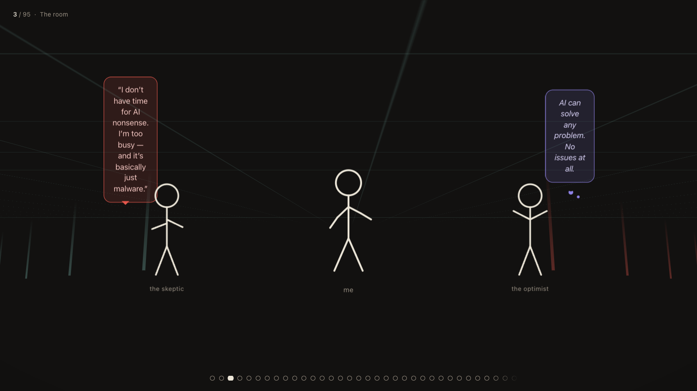

# How To Create a Self-Evolving Autonomous Offensive Security Agent

**BSides Kraków 2026** · Jyrki Huhta — Cyber Security Specialist, IQM Quantum Computers Oyj



Six months of building **Molly**, an autonomous offensive security agent: what genuinely
works, what genuinely breaks, and the war stories from in between. The talk takes the
skeptic and the optimist equally seriously and walks down both their avenues before
showing the machine itself.

This repository is the presentation.

## Showing it

```sh
git clone git@github.com:jyrkihuhta/bsideskrakow2026.git
cd bsideskrakow2026
open index.html          # macOS — or just double-click it
```

That is the whole install. There is no build step, no package manager and no network
access at runtime: the deck is one self-contained HTML file plus its media.

If the opening film does not start, serve the folder instead of opening the file
directly — browsers apply stricter autoplay rules to `file://` URLs:

```sh
python3 -m http.server 8000
# then open http://localhost:8000
```

Go full screen before you begin (`F11`, or `⌃⌘F` on macOS). The deck is built for 16:9
and is checked at 1280×720 and 1920×1080.

## Driving it

| Key | |
|---|---|
| `→` `space` `PageDown` · or click | next stop |
| `←` `PageUp` | previous stop |
| `s` | speaker notes for the current stop (see the last section) |
| `t` | the closing grand tour — a slow flight around the whole diorama |
| `o` | overview |
| `?` or `h` | key help |
| `1`–`9` | jump to one of the first stops |

Any stop can be deep-linked by index, zero-based: `index.html#88` opens straight on
stop 89. Useful for rehearsing one section, and for finding your place again if the
browser is restarted mid-talk.

## How it is built

There are no slides. The deck is a single 3D space built out of CSS transforms
(`perspective` + `preserve-3d`), and every "stop" is a camera pose inside it — a
position, a yaw, a pitch and a dolly:

```js
{px:-1500, py:2760, pz:-1400, yaw:0, pitch:6, dz:400, title:"Looking for help", ms:1700,
 note:"The human anecdote among the machine ones. …"}
```

Moving between two stops is one CSS transition on the world, which is why the
transitions look like camera moves rather than slide changes. Content is anchored in
the space and revealed by index with `data-show="88-92"`, so a panel appears when its
stop arrives and stays for as long as the window says.

The stick figures are inline SVG rigs, animated per joint. The three films are
background layers. Everything else — the room, the avenues, the architecture board,
the climbing column of ideas — is CSS.

## What is in here

```
index.html          the presentation — 95 stops, ~150 KB, self-contained
media/              the four films and every still the deck references
docs/preview.png    the image at the top of this README

speaker-notes.js    optional, git-ignored — the presenter's notes, one per stop
```

## Credits and notes

- The AI-pentesting radar on stop 18 is **Wavestone's** "Radar of AI-Powered Pentesting
  Solutions", used as published and credited on the slide.
- The opening and interlude films were generated with MiniMax / Hailuo AI.
- **The speaker notes are not in this repository.** They live in a `speaker-notes.js`
  that sits next to `index.html` and is git-ignored. If the file is there, `s` shows the
  note for the current stop; if it is not, everything else behaves exactly the same. What
  each stop is *for* is in the stop titles and in the comments through `index.html`.
- The films were re-encoded for distribution (the masters were 3528×2344 at 58 Mbps);
  they are visually identical at projector resolution and the repo is 20 MB instead of 93 MB.

© 2026 Jyrki Huhta. The talk, its text and its diagrams are mine; third-party material
is credited above.
